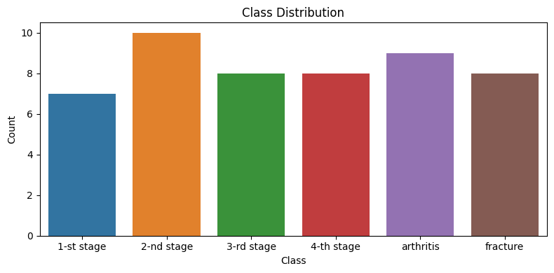
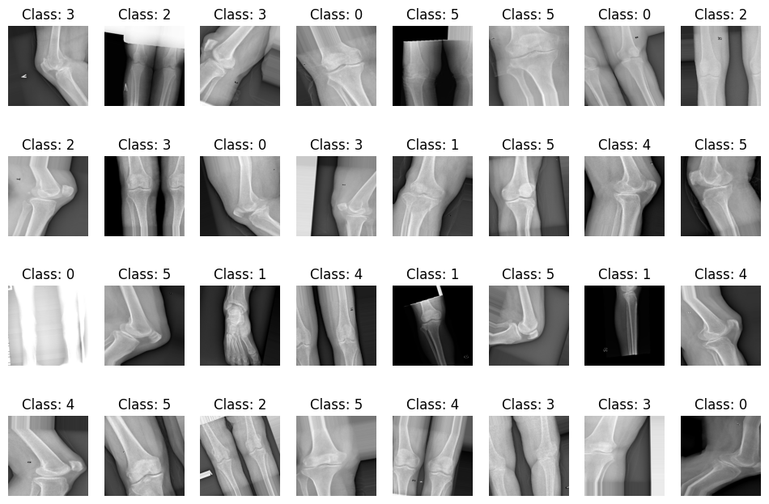
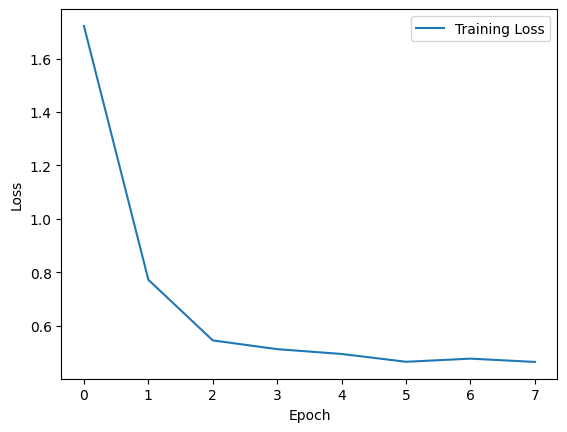
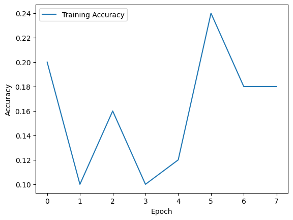
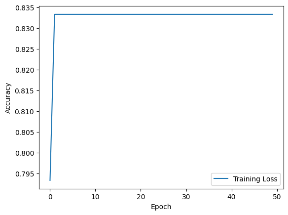
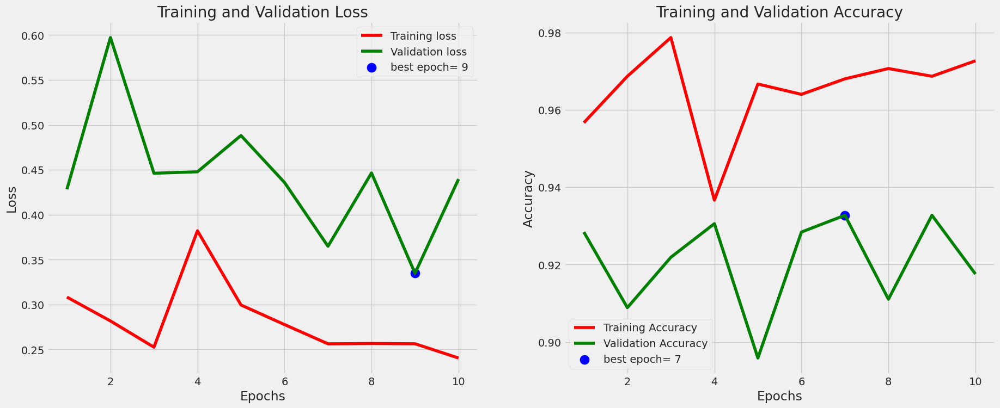

# Knee Osteoarthritis Detection Project

This repository contains the code and documentation for a knee osteoarthritis detection project, focusing on the impact of image augmentation and transfer learning on diagnostic accuracy.

## Overview

Knee arthritis is a significant concern affecting patient health, and early prediction is crucial for effective management. This project explores the use of deep learning models, including VGG16, ResNet50, DenseNet, and EfficientNetB5, for knee arthritis severity assessment. The most promising model, EfficientNetB5, was selected and further improved through image augmentation techniques, resulting in a remarkable accuracy improvement of 97%.

## Dataset

The dataset used in this project is sourced from the Osteoarthritis Initiative (OAI) via [Dataset Link](https://drive.google.com/drive/folders/1uEJn7qObDGQ9ydrKEMsQs7mlAQXt2wC?usp=share_link).

### Data Collection and Preprocessing

The dataset comprises X-ray images of knee joints graded using the Kellgren–Lawrence (KL) scale. The preprocessing steps include standardization of images, filtering for available KL ratings, and achieving a balanced dataset.

## Methodology

### Transfer Learning and Neural Networks

To predict knee osteoarthritis, the project utilizes transfer learning with pre-trained models (VGG16, ResNet50, DenseNet, EfficientNetB5). The initial models were evaluated, and EfficientNetB5 was chosen for further refinement.

### Image Augmentation Techniques

Various image augmentation techniques enhanced dataset variability, including rotation, zooming, shear mapping, and horizontal flipping. These techniques significantly contributed to the improvement of the model's predictive accuracy.

## Results

The project achieved the following accuracies for individual models:

- VGG16: 72%
- ResNet50: 51%
- DenseNet: 64%
- EfficientNetB5: 83%

After introducing image augmentation and sampling techniques, the refined EfficientNetB5 model achieved an accuracy of 97.68%.

### Visualization








After introducing image augmentation and sampling techniques, the refined EfficientNetB5 model achieved an accuracy of 97.68%.

## Dataset

- [Download Dataset](https://drive.google.com/drive/folders/1-uEJn7qObDGQ9ydrKEMsQs7mlAQXt2wC?usp=share_link)

## Usage

1. Clone the repository:

   ```bash
   git clone https://github.com/[Your Username]/knee-osteoarthritis-detection.git
